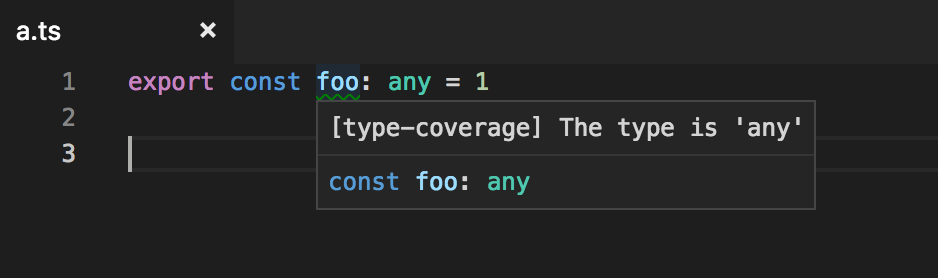
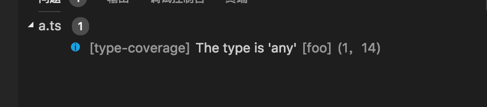

# vscode-type-coverage

VSCode plugin for type-coverage<https://github.com/plantain-00/type-coverage>.

## features





## extension url

<https://marketplace.visualstudio.com/items?itemName=york-yao.vscode-type-coverage>

## develop

1. `yarn`
1. `yarn watch`
1. Press `F5` to start

## changelogs

```txt
// v2
config options in `Preferences` - `Settings` - `Extensions` - `Type Coverage`

// v1
config options in package.json
```
